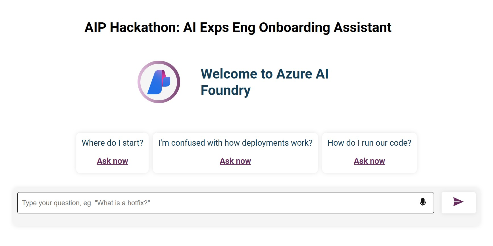

# Engineer Onboarding Assistant w/ RAG

## Important Security Notice 

This template, the application code and configuration it contains, has been built to showcase Microsoft Azure specific services and tools. We strongly advise our customers not to make this code part of their production environments without implementing or enabling additional security features.  

For a more comprehensive list of best practices and security recommendations for Intelligent Applications, visit our [official documentation](https://learn.microsoft.com/azure/developer/ai/get-started-securing-your-ai-app).

**Sample application code is included in this project**. You can use or modify this app code or you can rip it out and include your own.

## Overview

This sample implements a RAG assistant for onboarding new engineers as well as an interface for chatting with the assistant. 

### Context & Problem 💭
Onboarding can be challenging and overwhelming, especially for interns and new graduates 🎓. A significant part of onboarding involves learning the common knowledge base within the team 🧠. While team members can easily explain these topics, they often seem complex or confusing to newcomers. 

### Goals & Approach 🚀
The goal of this sample is to build a resource that eases the onboarding process for newcomers and alleviates the workload of team members who assist them.

### Phase 1: RAG Chatbot 🤖
This first part of this sample is based on the [Azure AI RAG Workshop](https://github.com/nitya/azure-ai-rag-workshop).

You can complete this phase with our code and your data following [these instructions](./src/phase1/README.md).

### Phase 2: Web page 🖱️
The second part of this sample allows users to interact with the RAG Chatbot from Phase 1, modifying the [Azure OpenAI chat frontend sample](https://github.com/Azure-Samples/azure-openai-chat-frontend)

After completing Phase 1, you can run the web page with your chatbot following [these instructions](./src/phase2/README.md).

## Resources

1. [Prompty Documentation](https://prompty.ai)
1. [Azure AI Foundry Documentation](https://aka.ms/aistudio)
1. [Develop AI Apps using Azure AI Services](https://aka.ms/ai-apps-docs)
1. [Azure AI Templates with Azure Developer CLI](https://aka.ms/ai-studio/azd-templates)

## Trademark Notice

This project may contain trademarks or logos for projects, products, or services. Authorized use of Microsoft trademarks or logos is subject to and must follow [Microsoft’s Trademark & Brand Guidelines](https://www.microsoft.com/en-us/legal/intellectualproperty/trademarks/usage/general). Use of Microsoft trademarks or logos in modified versions of this project must not cause confusion or imply Microsoft sponsorship. Any use of third-party trademarks or logos are subject to those third-party’s policies.

## Responsible AI Guidelines

This project follows below responsible AI guidelines and best practices, please review them before using this project:

- [Microsoft Responsible AI Guidelines](https://www.microsoft.com/en-us/ai/responsible-ai)
- [Responsible AI practices for Azure OpenAI models](https://learn.microsoft.com/en-us/legal/cognitive-services/openai/overview)
- [Safety evaluations transparency notes](https://learn.microsoft.com/en-us/azure/ai-studio/concepts/safety-evaluations-transparency-note)